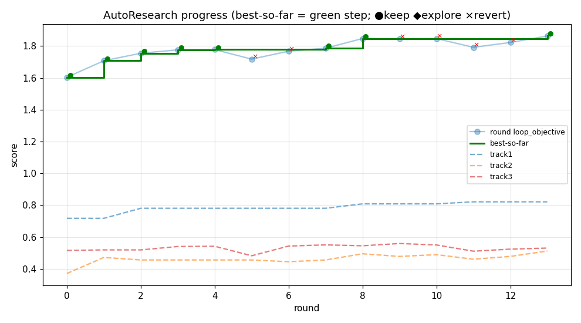

# 🔥 MemForge

[English](README.md) | **中文**

**一个把空间记忆当作具身智能体外部资源来评测的基准 —— 同时也是一个让编码智能体
自己「锻造」空间记忆并自我改进的自动研究循环。**

> **MemForge** = **Mem**ory(记忆)+ **Forge**(锻造):本项目既*评测*各种空间记忆方法,
> 又让 AI 针对真实指标*锻造*(设计 + 迭代精修)一个全新的记忆。

长时间运行的机器人需要*空间记忆*:一个持久、可查询的表示,记录它见过的一切。MemForge 回答两个问题:

1. **一个给定的空间记忆方法到底有多好** —— 当智能体必须真正*使用*它来回答问题时?我们评测每个方法的
   **原生记忆格式** —— 不重新实现、不臆测 API —— 通过它声明的 Python API,或通过一个「每查询 LLM + 原生工具」的循环。
2. **AI 能否设计出比人工系统更好的空间记忆?** 给编码智能体提供指标、感知栈和一块白板,让它跑一个
   git 驱动的*保留/回滚(keep/revert)*自动研究循环:提出代码 → 构建记忆 → 自评 → 提升就 commit,
   没提升就 revert → 持续数小时。

一切都是**包优先(package-first)**:每个方法(人工或 AI 设计)都导出一个最小的*记忆包*,
同一套评测器在同样的场景上给它们打分。

---

## 基准 —— 三个赛道(+ 第四个进行中)

| 赛道 | 能力键 | 测什么 | 主指标 | 数据 |
|---|---|---|---|---|
| **1** | `track1_object_location` | 在 3D 中定位一个具名物体 | success@1 | ScanNet |
| **2** | `track2_scanrefer` | 把指代表达消歧到唯一实例 | acc@0.5m | ScanRefer / ScanNet |
| **3** | `track3_openeqa` | 回答开放式空间问题 | LLM-Match | OpenEQA (ScanNet) |
| **4** *(进行中)* | `track4_oc_navqa` | 长时程机器人轨迹问答 | 按类型* | OC-NaVQA / CODa |

\* 赛道 4 按问题类型评分:position(L2 距离)、binary(准确率)、time/duration(分钟误差)、text(LLM 裁判)。

**两种评测接口**,都保留方法的真实记忆:
- `fixed_api` —— 调用记忆包声明的原生查询入口(确定性、快)。
- `tool_llm` —— 每个查询由一个 LLM 智能体调用该方法的原生检索工具并给出答案。这是**公平的跨方法协议**
  (同一个智能体、同样的场景;唯一变量是记忆本身)。

不支持的 API 会被如实报告为 `invalid` 并附原因 —— 绝不静默近似。

---

## AI 自设计的记忆(核心亮点)

不用人工搭记忆,而是让编码智能体在固定契约下从零设计一个,再用 git 驱动的保留/回滚循环
(Karpathy 式 AutoResearch)持续改进:

```
提出代码 → 构建记忆(所有 dev 场景) → 用真实的 Track 1/2/3 评测器打分
   → loop_objective 提升了吗? ─ 是 → git commit(保留)
                              └ 否 → git reset(回滚)
   → 循环直到时间预算耗尽
```

git log *就是*实验日志 —— 每一次 commit 都是一次真实的提升。最近一次运行(**run4**:盲测/纯发现、
6 个 dev 场景、14 小时预算、T2 在与 held-out 一致的 15 题子集上评测)在三个赛道上稳步爬升:



*绿色阶梯 = 目前最优的 `loop_objective`;● 保留,× 回滚。run4 在没有任何先验提示的情况下,
自己发现了一个以物体为中心的 3D 语义地图(YOLO-World 检测 → 深度反投影 → 多视角融合 →
摊销式 qwen 描述/嵌入),然后自我改进:T2 的空间关系重排、T1 的同义词扩展覆盖,以及用
bbox 体积中心作为预测位置(与 GT 评分中心对齐)—— 把 T1 从 **0.72→0.82**、T2 从 **0.37→0.51**。*

---

## 环境配置

**➡️ 完整的、与机器无关的配置说明见 [docs/SETUP.md](docs/SETUP.md)** —— 它涵盖三层
(评测环境、共享模块 + LLM 栈、以及每个 baseline 包括麻烦的 DAAAM 环境)。
**只跑基准评测 + AI 自设计记忆**的快速版(不需要任何 baseline 仓库):

```bash
# 1. 评测环境
conda env create -f environment.evaluation.yml      # env: spatial-memory-eval, python 3.10
conda activate spatial-memory-eval
pip install -e .
#   (environment.evaluation.yml 里用本地路径 pin 了两个 baseline 仓库 —— 只有跑 ClawS/HOV-SG
#    时才需要;只跑评测器时可注释掉。详见 docs/SETUP.md。)

# 2. 本地 LLM 栈 (Ollama): AI 自设计记忆的描述器 + 嵌入
ollama pull qwen3.5:4b            # 4.7B 视觉描述器 (VILA 替代)
ollama pull qwen3-embedding:0.6b  # 0.6B, 1024 维文本嵌入

# 3. NAS 上的共享感知模块 (YOLO-World-L + ScanNet200 类表);见
#    .codex/modules.md + path_registry.md。注意:import ultralytics 前需 torch.backends.cudnn.enabled=False。

# 4. 云端 LLM (Bedrock): 答题智能体 + 赛道 3 裁判
export CLAUDE_CODE_USE_BEDROCK=1 AWS_REGION=us-west-2   # haiku 答题 + sonnet 裁判
```

各 baseline(DAAAM / ClawS / ReMEmbR / HOV-SG)各自需要自己的仓库/环境 —— **见
[docs/SETUP.md](docs/SETUP.md) 第 3 层**(尤其 DAAAM 需要独立 conda 环境 + colcon 编译的 Hydra
工作区 + TensorRT FastSAM)。生成的产物(`memories/`、`results/`、`benchmarks/`、`data/`)
已被 gitignore;请用 `.codex/path_registry.md` 里的 NAS 路径。

---

## 运行 baseline

五个人工/对照方法已适配到记忆包契约:**DAAAM**(Hydra 3D 场景图)、**ClawS**(物体地图 + sqlite-vec)、
**ReMEmbR**(描述记忆),外加 **LLM-with-captions** 和 **Multi-frame-VLM** 两个对照。

**构建基准数据**(每个数据集一次):

```bash
python scripts/build_track1_data.py --scene-id <scene> --dataset scannet
python scripts/build_track2_data.py --scene-id <scene>
python scripts/build_track3_data.py --dataset scannet
```

**评测单个记忆包**(某赛道某场景):

```bash
python scripts/evaluate_track1.py <package_dir> --dataset scannet --scene-id <scene> \
    --mode tool_llm --llm-command "<agent CLI template>" --output <out.json>
```

**一键全跑** —— 所有方法 × 10 个 held-out 场景 × 3 个赛道(驱动脚本会接好共享检测器、Haiku 智能体、Sonnet 裁判):

```bash
# scripts/methods/eval_all_scannet.sh <track|all> <fixed_api|tool_llm> <methods_csv>
bash scripts/methods/eval_all_scannet.sh all tool_llm daaam,claws,remembr,remembr_captions,multiframe_vlm
```

### Held-out 结果(10 个 ScanNet 场景,`tool_llm`)

| 方法 | T1 success@1 | T2 acc@0.5m | T3 LLM-Match | 实时构建 |
|---|---|---|---|---|
| **AI 自设计** (run2, 冻结) | **0.774** | **0.360** | 0.502 | ~0.9 秒/帧 |
| DAAAM (scene_graph) | 0.386 | 0.330 | 0.367 | 0.012 秒/帧 |
| ClawS (object_map) | 0.290 | 0.351 | 0.340 | 0.095 秒/帧 |
| ReMEmbR (caption) | 0.045 | 0.000 | 0.498 | 不适用(稀疏) |

AI 自设计的记忆在每个赛道上都是最优或并列最优。完整分析、run3 深度复盘(一个*更激进*的设计反而
不如朴素物体地图 —— 一个真实的负面结果)以及 baseline 公平性审计,见
`.codex/agent_designed_run3_analysis.md` 和 `.codex/scannet_10scene_results.md`。

---

## 自己跑自动设计循环

```bash
# 1. 准备 dev 场景(下载 GT + 抽取 RGB-D layout + 构建 track1/2/3 的 dev 测试)
bash scripts/agent_designed/prepare_dev_scene.sh <scene_id>

# 2. 创建一个全新的、自包含的沙盒(空 starter/、dev 场景、文档、harness)
python scripts/agent_designed/make_sandbox.py --variant loop_fixed_tests \
    --sandbox-root ~/my_autodesign_run \
    --dev-scene-id <scene_a> --dev-scene-id <scene_b> ...

# 3. 放入任务 prompt + 初始化 git,然后让编码智能体跑循环。
#    每一轮智能体修改 starter/ 并调用:
python autoresearch_round.py --build-cmd "python starter/build_memory.py" \
    --message "round N: <改了什么、为什么>"
#    -> 构建所有 dev 场景、在固定 dev 测试上打分,并自动保留或回滚。
```

对于长时间无人值守的运行,`scripts/agent_designed/run4_supervisor.sh <sandbox> <wall_seconds>`
会让设计智能体工作到硬性时间预算,若它提前退出就重启(沙盒会持久化,重启后会读自己的
DESIGN_NOTES / history / git log 继续)。

被打分的目标函数:

```
loop_objective = success@1[T1] + acc@0.5m[T2] + llm_match[T3] − cost_penalty
```

`cost_penalty` 让构建保持接近实时(≤0.2 秒/帧)且记忆紧凑(≤50 MB/场景)。端到端查询延迟会被
测量并报告(但*不*计入分数),这样循环就无法通过把重计算推迟到查询时来作弊。

---

## 最小记忆包

每个方法都导出同样的结构,由同一套评测器消费:

```text
manifest.json        # 方法 + 数据集元信息
capabilities.json    # 支持哪些 fixed API / agent 工具(否则 "invalid" + 原因)
memory/              # 方法的原生记忆(物体表、DB、描述、DSG……)
tools/               # 包内 Python 入口(query_object, resolve_referring, ...)
schema.md  schemas/  evidence/  raw_links/  build_log.json
```

校验一个记忆包:

```bash
python -m spatial_memory_evaluation.memory_package_validator <package_dir>
```

完整契约见 [.codex/memory_package_spec.md](.codex/memory_package_spec.md)。

---

## 仓库结构

- `spatial_memory_evaluation/track{1,2,3,4}/` —— 各赛道的基准构建器 + 评测器。
- `spatial_memory_evaluation/tool_llm/` —— 每查询 LLM + 原生工具运行器(公平协议)。
- `spatial_memory_evaluation/agent_designed/` —— 自设计 harness:dev 评分器、每场景 session 评测、契约/工作区。
- `spatial_memory_evaluation/common/`、`schemas/`、`assets/` —— 共享 IO、schema、类表。
- `scripts/build_track*_data.py`、`scripts/evaluate_track*.py` —— 数据 + 评测 CLI。
- `scripts/methods/` —— 各 baseline 适配器 + `eval_all_scannet.sh`;`scripts/methods/coda/` 用于赛道 4。
- `scripts/agent_designed/` —— 沙盒生成器、自动研究轮控制器、supervisor、评分器。
- `.codex/` —— 设计笔记、规范、注册表、结果与分析(从 `.codex/README.md` 开始)。
- `examples/` —— 小的有效记忆包样例。

## 文档

从 [.codex/README.md](.codex/README.md) 开始。关键文档:`agentic_eval.md`(愿景)、
`memory_package_spec.md`(契约)、`baseline_registry.md`(方法)、`path_registry.md`(路径)、
`modules.md`(共享模块)、`agent_designed_baseline.md`(自设计),以及 `.codex` 索引里列出的结果/分析文档。
